# Readme Stats Action

[](https://github.com/soulteary/github-readme-stats-action)


## Languages / 语言 / Sprachen / Lingue / 언어 / 言語

- [English](README.md)
- [简体中文](README.zh.md)
- [Deutsch](README.de.md)
- [Italiano](README.it.md)
- [한국어](README.kr.md)
- [日本語](README.ja.md)

Generate [GitHub Readme Stats](https://github.com/soulteary/github-readme-stats) cards in your GitHub Actions workflow, commit them to your profile repository, and embed them directly from there.

This Action uses the Go implementation of `github-readme-stats` service, downloading pre-built binaries from GitHub Releases and calling them via CLI to generate statistics cards.

## Quick Start

```yaml
name: Update README cards

on:
  schedule:
    - cron: "0 0 * * *" # Runs once daily at midnight
  workflow_dispatch:

jobs:
  build:
    runs-on: ubuntu-latest

    permissions:
      contents: write

    steps:
      - uses: actions/checkout@v4

      - name: Generate stats card
        uses: soulteary/github-readme-stats-action@v1.0.0
        with:
          card: stats
          options: 'username=${{ github.repository_owner }}&show_icons=true'
          path: profile/stats.svg
          token: ${{ secrets.GITHUB_TOKEN }}

      - name: Generate top languages card
        uses: soulteary/github-readme-stats-action@v1.0.0
        with:
          card: top-langs
          options: 'username=${{ github.repository_owner }}&layout=compact&langs_count=6'
          path: profile/top-langs.svg
          token: ${{ secrets.GITHUB_TOKEN }}

      - name: Generate pin card
        uses: soulteary/github-readme-stats-action@v1.0.0
        with:
          card: pin
          options: 'username=soulteary&repo=github-readme-stats'
          path: profile/pin-github-readme-stats.svg
          token: ${{ secrets.GITHUB_TOKEN }}

      - name: Commit cards
        run: |
          git config user.name "github-actions[bot]"
          git config user.email "41898282+github-actions[bot]@users.noreply.github.com"
          git add profile/*.svg
          git commit -m "Update README cards" || exit 0
          git push
```

Then embed from your profile README:

```md


```

## Deployment Options

This action is a recommended deployment option. You can also deploy on Vercel or other platforms. See the [GitHub Readme Stats README](https://github.com/soulteary/github-readme-stats#deploy-on-your-own).

## Inputs

- `card` (required): Card type to generate. Supported: `stats`, `top-langs`, `pin`, `wakatime`, `gist`.
- `options`: Options for the card as a query string (`key=value&...`) or JSON. If `username` is omitted, the action uses the repository owner.
- `path`: Output path for the SVG file. Defaults to `profile/<card>.svg`.
- `token`: GitHub token (PAT or `GITHUB_TOKEN`). For private repo stats, use a [PAT](https://docs.github.com/en/authentication/keeping-your-account-and-data-secure/managing-your-personal-access-tokens) with `repo` and `read:user` scopes.
- `version`: Version of github-readme-stats binary to use (e.g., `v1.0.0`). Defaults to `v1.0.0`. Use `latest` to get the latest release.
- `repo`: GitHub repository in format `owner/repo`. Defaults to `soulteary/github-readme-stats`.

## Outputs

- `path`: Path where the SVG file was written.

## Options Parameters

The `options` input accepts different parameters depending on the card type:

### Stats Card Parameters

- `username` (required) - GitHub username
- `hide` - Hide specific stats (comma-separated, e.g., `stars,commits`)
- `hide_title` - Hide title
- `hide_border` - Hide border
- `hide_rank` - Hide rank
- `show_icons` - Show icons
- `include_all_commits` - Include all commits
- `theme` - Theme name (80+ themes available)
- `bg_color` - Background color (hexadecimal)
- `title_color` - Title color
- `text_color` - Text color
- `icon_color` - Icon color
- `border_color` - Border color
- `border_radius` - Border radius
- `locale` - Language code (e.g., `zh`, `en`, `de`, `it`, `kr`, `ja`)
- `layout` - Layout type (`compact`, `normal`)

### Top Languages Card Parameters

- `username` (required) - GitHub username
- `hide` - Hide specific languages (comma-separated)
- `layout` - Layout type (`compact`, `normal`)
- `langs_count` - Number of languages to show
- `theme` - Theme name
- `locale` - Language code

### Pin Card Parameters

- `username` (required) - GitHub username
- `repo` (required) - Repository name
- `theme` - Theme name
- `show_owner` - Show owner
- `locale` - Language code

### WakaTime Card Parameters

- `username` (required) - WakaTime username
- `theme` - Theme name
- `hide` - Hide specific stats
- `layout` - Layout type (`compact`, `normal`)
- `langs_count` - Number of languages to show
- `hide_progress` - Hide progress bar
- `display_format` - Display format (`percent`, `time`)
- `locale` - Language code

### Gist Card Parameters

- `id` (required) - Gist ID
- `theme` - Theme name
- `locale` - Language code

## 📖 Usage Examples

Here are some examples of what you can create with this action:

### GitHub Stats Card

**Basic:**

```yaml
- name: Generate stats card
  uses: soulteary/github-readme-stats-action@v1.0.0
  with:
    card: stats
    options: 'username=${{ github.repository_owner }}'
    path: profile/stats.svg
    token: ${{ secrets.GITHUB_TOKEN }}
```


**Dark Theme:**

```yaml
- name: Generate stats card
  uses: soulteary/github-readme-stats-action@v1.0.0
  with:
    card: stats
    options: 'username=${{ github.repository_owner }}&theme=dark'
    path: profile/stats.svg
    token: ${{ secrets.GITHUB_TOKEN }}
```


**Compact Layout:**

```yaml
- name: Generate stats card
  uses: soulteary/github-readme-stats-action@v1.0.0
  with:
    card: stats
    options: 'username=${{ github.repository_owner }}&layout=compact'
    path: profile/stats.svg
    token: ${{ secrets.GITHUB_TOKEN }}
```


**With Icons:**

```yaml
- name: Generate stats card
  uses: soulteary/github-readme-stats-action@v1.0.0
  with:
    card: stats
    options: 'username=${{ github.repository_owner }}&show_icons=true'
    path: profile/stats.svg
    token: ${{ secrets.GITHUB_TOKEN }}
```


**Custom Theme:**

```yaml
- name: Generate stats card
  uses: soulteary/github-readme-stats-action@v1.0.0
  with:
    card: stats
    options: 'username=${{ github.repository_owner }}&bg_color=0d1117&title_color=ff6b6b&text_color=c9d1d9&border_color=30363d'
    path: profile/stats.svg
    token: ${{ secrets.GITHUB_TOKEN }}
```


**Hide Rank:**

```yaml
- name: Generate stats card
  uses: soulteary/github-readme-stats-action@v1.0.0
  with:
    card: stats
    options: 'username=${{ github.repository_owner }}&hide_rank=true&show_icons=true'
    path: profile/stats.svg
    token: ${{ secrets.GITHUB_TOKEN }}
```


### Repository Pin Card

**Basic:**

```yaml
- name: Generate pin card
  uses: soulteary/github-readme-stats-action@v1.0.0
  with:
    card: pin
    options: 'username=${{ github.repository_owner }}&repo=github-readme-stats'
    path: profile/pin.svg
    token: ${{ secrets.GITHUB_TOKEN }}
```



**Themed:**

```yaml
- name: Generate pin card
  uses: soulteary/github-readme-stats-action@v1.0.0
  with:
    card: pin
    options: 'username=${{ github.repository_owner }}&repo=github-readme-stats&theme=dark'
    path: profile/pin.svg
    token: ${{ secrets.GITHUB_TOKEN }}
```



**With Owner:**

```yaml
- name: Generate pin card
  uses: soulteary/github-readme-stats-action@v1.0.0
  with:
    card: pin
    options: 'username=${{ github.repository_owner }}&repo=github-readme-stats&show_owner=true'
    path: profile/pin.svg
    token: ${{ secrets.GITHUB_TOKEN }}
```


### Top Languages Card

**Basic:**

```yaml
- name: Generate top languages card
  uses: soulteary/github-readme-stats-action@v1.0.0
  with:
    card: top-langs
    options: 'username=${{ github.repository_owner }}'
    path: profile/top-langs.svg
    token: ${{ secrets.GITHUB_TOKEN }}
```



**Compact Layout:**

```yaml
- name: Generate top languages card
  uses: soulteary/github-readme-stats-action@v1.0.0
  with:
    card: top-langs
    options: 'username=${{ github.repository_owner }}&layout=compact&langs_count=6'
    path: profile/top-langs.svg
    token: ${{ secrets.GITHUB_TOKEN }}
```



**Themed:**

```yaml
- name: Generate top languages card
  uses: soulteary/github-readme-stats-action@v1.0.0
  with:
    card: top-langs
    options: 'username=${{ github.repository_owner }}&theme=radical&langs_count=8'
    path: profile/top-langs.svg
    token: ${{ secrets.GITHUB_TOKEN }}
```


**Hide Specific Languages:**

```yaml
- name: Generate top languages card
  uses: soulteary/github-readme-stats-action@v1.0.0
  with:
    card: top-langs
    options: 'username=${{ github.repository_owner }}&hide=html,css,scss'
    path: profile/top-langs.svg
    token: ${{ secrets.GITHUB_TOKEN }}
```


### Gist Card

**Basic:**

```yaml
- name: Generate gist card
  uses: soulteary/github-readme-stats-action@v1.0.0
  with:
    card: gist
    options: 'id=bbfce31e0217a3689c8d961a356cb10d'
    path: profile/gist.svg
    token: ${{ secrets.GITHUB_TOKEN }}
```


**Themed:**

```yaml
- name: Generate gist card
  uses: soulteary/github-readme-stats-action@v1.0.0
  with:
    card: gist
    options: 'id=bbfce31e0217a3689c8d961a356cb10d&theme=dark'
    path: profile/gist.svg
    token: ${{ secrets.GITHUB_TOKEN }}
```



### WakaTime Card

**Basic:**

```yaml
- name: Generate wakatime card
  uses: soulteary/github-readme-stats-action@v1.0.0
  with:
    card: wakatime
    options: 'username=yourname'
    path: profile/wakatime.svg
    token: ${{ secrets.GITHUB_TOKEN }}
```


**Compact Layout:**

```yaml
- name: Generate wakatime card
  uses: soulteary/github-readme-stats-action@v1.0.0
  with:
    card: wakatime
    options: 'username=yourname&layout=compact'
    path: profile/wakatime.svg
    token: ${{ secrets.GITHUB_TOKEN }}
```


**Themed:**

```yaml
- name: Generate wakatime card
  uses: soulteary/github-readme-stats-action@v1.0.0
  with:
    card: wakatime
    options: 'username=yourname&theme=radical&langs_count=5'
    path: profile/wakatime.svg
    token: ${{ secrets.GITHUB_TOKEN }}
```



**Hide Progress:**

```yaml
- name: Generate wakatime card
  uses: soulteary/github-readme-stats-action@v1.0.0
  with:
    card: wakatime
    options: 'username=yourname&hide_progress=true'
    path: profile/wakatime.svg
    token: ${{ secrets.GITHUB_TOKEN }}
```


### JSON Options

You can also use JSON format for options:

```yaml
- name: Generate stats card
  uses: soulteary/github-readme-stats-action@v1.0.0
  with:
    card: stats
    options: '{"username":"${{ github.repository_owner }}","show_icons":true,"hide_rank":true,"theme":"dark"}'
    path: profile/stats.svg
    token: ${{ secrets.GITHUB_TOKEN }}
```

### Specify Version

You can specify a specific version of the binary to use:

```yaml
- name: Generate stats card
  uses: soulteary/github-readme-stats-action@v1.0.0
  with:
    card: stats
    options: 'username=${{ github.repository_owner }}&show_icons=true'
    path: profile/stats.svg
    token: ${{ secrets.GITHUB_TOKEN }}
    version: v1.0.0  # Use specific version
    # version: latest  # Or use latest release
```

## How It Works

This action works by:

1. **Detecting Platform**: Automatically detects the OS (Linux/macOS) and architecture (amd64/arm64)
2. **Downloading Binary**: Downloads the pre-built binary from GitHub Releases for the specified version
3. **Calling CLI**: Invokes the Go binary's CLI mode with the provided options
4. **Saving File**: Writes the generated SVG to the specified path

## Differences from Original Version

| Feature | Original Version | This Version |
|---------|-----------------|--------------|
| Implementation | Node.js | Bash |
| Service Call | Direct library function call | CLI call to Go binary |
| Dependencies | Node.js + npm package | curl (pre-installed) |
| Build | npm install | Download from Releases |
| Binary Source | npm package | GitHub Releases |

## Supported Platforms

- Linux (amd64, arm64)
- macOS (amd64, arm64)

The action automatically detects your runner's platform and downloads the appropriate binary.

## Notes

- This action uses the same renderers and fetchers as [soulteary/github-readme-stats](https://github.com/soulteary/github-readme-stats).
- No Go environment required - binaries are pre-built and downloaded from Releases.
- The service binary is temporarily downloaded and executed during the action run.
- For best performance, specify a version instead of using `latest` to avoid API calls.

## License

MIT License
