# Readme Stats Action

[](https://github.com/soulteary/github-readme-stats-action)


## Languages / 语言 / Sprachen / Lingue / 언어 / 言語

- [English](README.md)
- [简体中文](README.zh.md)
- [Deutsch](README.de.md)
- [Italiano](README.it.md)
- [한국어](README.kr.md)
- [日本語](README.ja.md)

在 GitHub Actions 工作流中生成 [GitHub Readme Stats](https://github.com/soulteary/github-readme-stats) 卡片，提交到你的 profile 仓库，并直接从那里嵌入。

本 Action 使用 Go 版本的 `github-readme-stats` 服务，从 GitHub Releases 下载预编译的二进制文件，通过 CLI 调用生成统计卡片。

## 快速开始

```yaml
name: Update README cards

on:
  schedule:
    - cron: "0 0 * * *" # 每天午夜运行一次
  workflow_dispatch:

jobs:
  build:
    runs-on: ubuntu-latest

    permissions:
      contents: write

    steps:
      - uses: actions/checkout@v4

      - name: Generate stats card
        uses: soulteary/github-readme-stats-action@v1.2.0
        with:
          card: stats
          options: 'username=${{ github.repository_owner }}&show_icons=true'
          path: profile/stats.svg
          token: ${{ secrets.GITHUB_TOKEN }}

      - name: Generate top languages card
        uses: soulteary/github-readme-stats-action@v1.2.0
        with:
          card: top-langs
          options: 'username=${{ github.repository_owner }}&layout=compact&langs_count=6'
          path: profile/top-langs.svg
          token: ${{ secrets.GITHUB_TOKEN }}

      - name: Generate pin card
        uses: soulteary/github-readme-stats-action@v1.2.0
        with:
          card: pin
          options: 'username=soulteary&repo=github-readme-stats'
          path: profile/pin-github-readme-stats.svg
          token: ${{ secrets.GITHUB_TOKEN }}

      - name: Commit cards
        run: |
          git config user.name "github-actions[bot]"
          git config user.email "41898282+github-actions[bot]@users.noreply.github.com"
          git add profile/*.svg
          git commit -m "Update README cards" || exit 0
          git push
```

然后在你的 profile README 中嵌入：

```md


```

## 部署选项

这是推荐的部署选项之一。你也可以在 Vercel 或其他平台上部署。参见 [GitHub Readme Stats README](https://github.com/soulteary/github-readme-stats#deploy-on-your-own)。

## 输入参数

- `card` (必需): 卡片类型。支持的类型：`stats`、`top-langs`、`pin`、`wakatime`、`gist`。
- `options`: 卡片选项，可以是查询字符串格式 (`key=value&...`) 或 JSON 格式。如果省略 `username`，Action 会使用仓库所有者。
- `path`: SVG 文件的输出路径。默认为 `profile/<card>.svg`。
- `token`: GitHub token (PAT 或 `GITHUB_TOKEN`)。对于私有仓库统计，请使用具有 `repo` 和 `read:user` 权限的 [PAT](https://docs.github.com/en/authentication/keeping-your-account-and-data-secure/managing-your-personal-access-tokens)。
- `version`: 要使用的 github-readme-stats 二进制文件版本（例如：`v1.0.0`）。默认为 `v1.0.0`。使用 `latest` 获取最新版本。
- `repo`: GitHub 仓库，格式为 `owner/repo`。默认为 `soulteary/github-readme-stats`。

## 输出参数

- `path`: 写入 SVG 文件的路径。

## 选项参数

`options` 输入根据卡片类型接受不同的参数：

### Stats 卡片参数

- `username` (必需) - GitHub 用户名
- `hide` - 隐藏指定统计项（逗号分隔，例如：`stars,commits`）
- `hide_title` - 隐藏标题
- `hide_border` - 隐藏边框
- `hide_rank` - 隐藏排名
- `show_icons` - 显示图标
- `include_all_commits` - 包含所有提交
- `theme` - 主题名称（80+ 主题可选）
- `bg_color` - 背景颜色（十六进制）
- `title_color` - 标题颜色
- `text_color` - 文本颜色
- `icon_color` - 图标颜色
- `border_color` - 边框颜色
- `border_radius` - 边框圆角
- `locale` - 语言代码（例如：`zh`、`en`、`de`、`it`、`kr`、`ja`）
- `layout` - 布局类型（`compact`、`normal`）

### Top Languages 卡片参数

- `username` (必需) - GitHub 用户名
- `hide` - 隐藏指定语言（逗号分隔）
- `layout` - 布局类型（`compact`、`normal`）
- `langs_count` - 要显示的语言数量
- `theme` - 主题名称
- `locale` - 语言代码

### Pin 卡片参数

- `username` (必需) - GitHub 用户名
- `repo` (必需) - 仓库名称
- `theme` - 主题名称
- `show_owner` - 显示所有者
- `locale` - 语言代码

### WakaTime 卡片参数

- `username` (必需) - WakaTime 用户名
- `theme` - 主题名称
- `hide` - 隐藏指定统计项
- `layout` - 布局类型（`compact`、`normal`）
- `langs_count` - 要显示的语言数量
- `hide_progress` - 隐藏进度条
- `display_format` - 显示格式（`percent`、`time`）
- `locale` - 语言代码

### Gist 卡片参数

- `id` (必需) - Gist ID
- `theme` - 主题名称
- `locale` - 语言代码

## 📖 使用示例

以下是一些使用本 Action 可以创建的示例：

### GitHub Stats 卡片

**基础版本：**

```yaml
- name: Generate stats card
  uses: soulteary/github-readme-stats-action@v1.2.0
  with:
    card: stats
    options: 'username=${{ github.repository_owner }}'
    path: profile/stats.svg
    token: ${{ secrets.GITHUB_TOKEN }}
```


**深色主题：**

```yaml
- name: Generate stats card
  uses: soulteary/github-readme-stats-action@v1.2.0
  with:
    card: stats
    options: 'username=${{ github.repository_owner }}&theme=dark'
    path: profile/stats.svg
    token: ${{ secrets.GITHUB_TOKEN }}
```


**紧凑布局：**

```yaml
- name: Generate stats card
  uses: soulteary/github-readme-stats-action@v1.2.0
  with:
    card: stats
    options: 'username=${{ github.repository_owner }}&layout=compact'
    path: profile/stats.svg
    token: ${{ secrets.GITHUB_TOKEN }}
```


**带图标：**

```yaml
- name: Generate stats card
  uses: soulteary/github-readme-stats-action@v1.2.0
  with:
    card: stats
    options: 'username=${{ github.repository_owner }}&show_icons=true'
    path: profile/stats.svg
    token: ${{ secrets.GITHUB_TOKEN }}
```


**自定义主题：**

```yaml
- name: Generate stats card
  uses: soulteary/github-readme-stats-action@v1.2.0
  with:
    card: stats
    options: 'username=${{ github.repository_owner }}&bg_color=0d1117&title_color=ff6b6b&text_color=c9d1d9&border_color=30363d'
    path: profile/stats.svg
    token: ${{ secrets.GITHUB_TOKEN }}
```


**隐藏排名：**

```yaml
- name: Generate stats card
  uses: soulteary/github-readme-stats-action@v1.2.0
  with:
    card: stats
    options: 'username=${{ github.repository_owner }}&hide_rank=true&show_icons=true'
    path: profile/stats.svg
    token: ${{ secrets.GITHUB_TOKEN }}
```


### Repository Pin 卡片

**基础版本：**

```yaml
- name: Generate pin card
  uses: soulteary/github-readme-stats-action@v1.2.0
  with:
    card: pin
    options: 'username=${{ github.repository_owner }}&repo=github-readme-stats'
    path: profile/pin.svg
    token: ${{ secrets.GITHUB_TOKEN }}
```



**主题版本：**

```yaml
- name: Generate pin card
  uses: soulteary/github-readme-stats-action@v1.2.0
  with:
    card: pin
    options: 'username=${{ github.repository_owner }}&repo=github-readme-stats&theme=dark'
    path: profile/pin.svg
    token: ${{ secrets.GITHUB_TOKEN }}
```



**显示所有者：**

```yaml
- name: Generate pin card
  uses: soulteary/github-readme-stats-action@v1.2.0
  with:
    card: pin
    options: 'username=${{ github.repository_owner }}&repo=github-readme-stats&show_owner=true'
    path: profile/pin.svg
    token: ${{ secrets.GITHUB_TOKEN }}
```


### Top Languages 卡片

**基础版本：**

```yaml
- name: Generate top languages card
  uses: soulteary/github-readme-stats-action@v1.2.0
  with:
    card: top-langs
    options: 'username=${{ github.repository_owner }}'
    path: profile/top-langs.svg
    token: ${{ secrets.GITHUB_TOKEN }}
```


**紧凑布局：**

```yaml
- name: Generate top languages card
  uses: soulteary/github-readme-stats-action@v1.2.0
  with:
    card: top-langs
    options: 'username=${{ github.repository_owner }}&layout=compact&langs_count=6'
    path: profile/top-langs.svg
    token: ${{ secrets.GITHUB_TOKEN }}
```


**主题版本：**

```yaml
- name: Generate top languages card
  uses: soulteary/github-readme-stats-action@v1.2.0
  with:
    card: top-langs
    options: 'username=${{ github.repository_owner }}&theme=radical&langs_count=8'
    path: profile/top-langs.svg
    token: ${{ secrets.GITHUB_TOKEN }}
```


**隐藏指定语言：**

```yaml
- name: Generate top languages card
  uses: soulteary/github-readme-stats-action@v1.2.0
  with:
    card: top-langs
    options: 'username=${{ github.repository_owner }}&hide=html,css,scss'
    path: profile/top-langs.svg
    token: ${{ secrets.GITHUB_TOKEN }}
```



### Gist 卡片

**基础版本：**

```yaml
- name: Generate gist card
  uses: soulteary/github-readme-stats-action@v1.2.0
  with:
    card: gist
    options: 'id=bbfce31e0217a3689c8d961a356cb10d'
    path: profile/gist.svg
    token: ${{ secrets.GITHUB_TOKEN }}
```



**主题版本：**

```yaml
- name: Generate gist card
  uses: soulteary/github-readme-stats-action@v1.2.0
  with:
    card: gist
    options: 'id=bbfce31e0217a3689c8d961a356cb10d&theme=dark'
    path: profile/gist.svg
    token: ${{ secrets.GITHUB_TOKEN }}
```


### WakaTime 卡片

**基础版本：**

```yaml
- name: Generate wakatime card
  uses: soulteary/github-readme-stats-action@v1.2.0
  with:
    card: wakatime
    options: 'username=yourname'
    path: profile/wakatime.svg
    token: ${{ secrets.GITHUB_TOKEN }}
```


**紧凑布局：**

```yaml
- name: Generate wakatime card
  uses: soulteary/github-readme-stats-action@v1.2.0
  with:
    card: wakatime
    options: 'username=yourname&layout=compact'
    path: profile/wakatime.svg
    token: ${{ secrets.GITHUB_TOKEN }}
```


**主题版本：**

```yaml
- name: Generate wakatime card
  uses: soulteary/github-readme-stats-action@v1.2.0
  with:
    card: wakatime
    options: 'username=yourname&theme=radical&langs_count=5'
    path: profile/wakatime.svg
    token: ${{ secrets.GITHUB_TOKEN }}
```


**隐藏进度条：**

```yaml
- name: Generate wakatime card
  uses: soulteary/github-readme-stats-action@v1.2.0
  with:
    card: wakatime
    options: 'username=yourname&hide_progress=true'
    path: profile/wakatime.svg
    token: ${{ secrets.GITHUB_TOKEN }}
```


### JSON 选项

你也可以使用 JSON 格式的选项：

```yaml
- name: Generate stats card
  uses: soulteary/github-readme-stats-action@v1.2.0
  with:
    card: stats
    options: '{"username":"${{ github.repository_owner }}","show_icons":true,"hide_rank":true,"theme":"dark"}'
    path: profile/stats.svg
    token: ${{ secrets.GITHUB_TOKEN }}
```

### 指定版本

你可以指定要使用的二进制文件版本：

```yaml
- name: Generate stats card
  uses: soulteary/github-readme-stats-action@v1.2.0
  with:
    card: stats
    options: 'username=${{ github.repository_owner }}&show_icons=true'
    path: profile/stats.svg
    token: ${{ secrets.GITHUB_TOKEN }}
    version: v1.0.0  # 使用指定版本
    # version: latest  # 或使用最新版本
```

## 工作原理

本 Action 的工作原理：

1. **检测平台**: 自动检测操作系统（Linux/macOS）和架构（amd64/arm64）
2. **下载二进制**: 从 GitHub Releases 下载指定版本的预编译二进制文件
3. **调用 CLI**: 使用提供的选项调用 Go 二进制文件的 CLI 模式
4. **保存文件**: 将生成的 SVG 写入指定路径

## 与原始版本的差异

| 特性 | 原始版本 | 本版本 |
|------|---------|--------|
| 实现语言 | Node.js | Bash |
| 服务调用 | 直接调用库函数 | 调用 Go 二进制 CLI |
| 依赖 | Node.js + npm 包 | curl（预装） |
| 构建 | npm install | 从 Releases 下载 |
| 二进制来源 | npm 包 | GitHub Releases |

## 支持的平台

- Linux (amd64, arm64)
- macOS (amd64, arm64)

Action 会自动检测运行器的平台并下载相应的二进制文件。

## 注意事项

- 本 Action 使用与 [soulteary/github-readme-stats](https://github.com/soulteary/github-readme-stats) 相同的渲染器和数据获取器。
- 无需 Go 环境 - 二进制文件已预编译并从 Releases 下载。
- 服务二进制文件在 Action 运行期间临时下载和执行。
- 为了获得最佳性能，建议指定版本而不是使用 `latest`，以避免 API 调用。

## 许可证

MIT License
